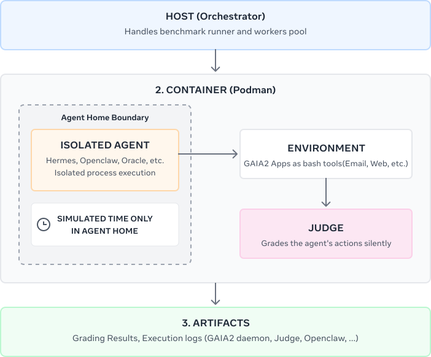

# Gaia2 CLI: Evaluating Agentic Systems in Real Execution Environments

Gaia2 CLI is the container-based evaluation stack for the Gaia2 benchmark. It
packages the Gaia2 app CLIs, launches agent runtimes behind a shared HTTP
contract, grades tool use against the scenario oracle, and generates
inspectable traces.

For the broader benchmark description and scenario concepts, see the
[`Gaia2 evaluation guide`](../docs/user_guide/gaia2_evaluation.rst) and the
[`scenario foundations`](../docs/foundations/scenarios.rst).

## Quick Start

### Requirements

- `podman`
- Python `3.12`
- [`uv`](https://docs.astral.sh/uv/)
- network access to Hugging Face and your chosen model provider
- `ANTHROPIC_API_KEY` if you want to use the ready-made Anthropic configs below

### 1. Copy `.env.example` and set your keys

```bash
cp .env.example .env
```

The runner auto-loads `.env` from this directory. For the included quickstart
configs, set `ANTHROPIC_API_KEY`.

If outbound access to providers or Hugging Face is restricted, you can also set:

- `GAIA2_PROXY_RELAY_URL`
- `GAIA2_CA_BUNDLE`
- `http_proxy` / `https_proxy` or `HTTP_PROXY` / `HTTPS_PROXY`
- optional `HF_TOKEN` to reduce Hugging Face throttling or rate limits

### 2. Build one runtime image

You can build all images with `make all`. Each target builds the shared base
image (`gaia2-cli`) plus the selected runtime. For a quickstart run, you only
need one image:

```bash
make gaia2-hermes
make gaia2-oc
```

### 3. Pick a ready-made config

- [`runner/examples/quickstart_hermes.toml`](runner/examples/quickstart_hermes.toml) if you want the same Anthropic `search` pass@1 setup on Hermes
- [`runner/examples/quickstart_openclaw.toml`](runner/examples/quickstart_openclaw.toml) if you want the same Anthropic `search` pass@1 setup on OpenClaw

Both use `claude-sonnet-4-6` for the agent and judge, so one key is enough to
get started. The judge is swappable. The shipped quickstart configs use
Anthropic Sonnet 4.6 as the judge for operational simplicity. You can point it
at a smaller model if you want lower cost, but score behavior may shift.
Separately, we calibrated `gpt-oss-120b` with `low` reasoning as the reference
judge configuration.

### 4. Run the config

```bash
# Hermes
uv run --project runner --python 3.12 gaia2-runner run-config \
    --config runner/examples/quickstart_hermes.toml

# OpenClaw
uv run --project runner --python 3.12 gaia2-runner run-config \
    --config runner/examples/quickstart_openclaw.toml
```

This downloads the public dataset [`meta-agents-research-environments/gaia2-cli`](https://huggingface.co/datasets/meta-agents-research-environments/gaia2-cli) automatically if needed and writes artifacts to the configured `output_dir`.

### 5. Open the trace viewer

```bash
# Hermes
uv run --project runner --python 3.12 gaia2-runner serve \
    --output-dir /tmp/gaia2_hermes_quickstart

# OpenClaw
uv run --project runner --python 3.12 gaia2-runner serve \
    --output-dir /tmp/gaia2_openclaw_quickstart
```

The runner also writes a static `index.html` into the output directory, so you
can reopen finished runs later without keeping the server alive.

## System Diagram



## Runtime Images

| Image | Use it when |
|-------|-------------|
| `localhost/gaia2-hermes:latest` | You want the Hermes runtime with the same Gaia2 tool surface and trace collection |
| `localhost/gaia2-oc:latest` | OpenClaw runtime for OpenAI, Anthropic, Google, OpenRouter, or OpenAI-compatible endpoints |
| `localhost/gaia2-oracle:latest` | You want an oracle replay baseline or a fast runner and judge smoke test |

Other useful examples:

- [`runner/examples/hermes_opus_gaia2_pass1.toml`](runner/examples/hermes_opus_gaia2_pass1.toml) for Hermes with direct Anthropic Opus 4.6 on all public benchmark splits, pass@1
- [`runner/examples/hermes_sonnet_gaia2_pass1.toml`](runner/examples/hermes_sonnet_gaia2_pass1.toml) for Hermes with direct Anthropic Sonnet 4.6 on all public benchmark splits, pass@1
- [`runner/examples/hermes_google_gaia2_pass1.toml`](runner/examples/hermes_google_gaia2_pass1.toml) for Hermes with direct Google AI Studio Gemini 3.1 Pro Preview on all public benchmark splits, pass@1
- [`runner/examples/hermes_gpt54_gaia2_pass1.toml`](runner/examples/hermes_gpt54_gaia2_pass1.toml) for Hermes with direct OpenAI GPT-5.4 on all public benchmark splits, pass@1
- [`runner/examples/openclaw_opus_gaia2_pass1.toml`](runner/examples/openclaw_opus_gaia2_pass1.toml) for OpenClaw with direct Anthropic Opus 4.6 on all public benchmark splits, pass@1
- [`runner/examples/openclaw_sonnet_gaia2_pass1.toml`](runner/examples/openclaw_sonnet_gaia2_pass1.toml) for OpenClaw with direct Anthropic Sonnet 4.6 on all public benchmark splits, pass@1
- [`runner/examples/openclaw_google_gaia2_pass1.toml`](runner/examples/openclaw_google_gaia2_pass1.toml) for OpenClaw with direct Google AI Studio Gemini 3.1 Pro Preview on all public benchmark splits, pass@1
- [`runner/examples/openclaw_gpt54_gaia2_pass1.toml`](runner/examples/openclaw_gpt54_gaia2_pass1.toml) for OpenClaw with direct OpenAI GPT-5.4 on all public benchmark splits, pass@1
- [`runner/examples/template_hermes_openai_compat.toml`](runner/examples/template_hermes_openai_compat.toml) as a generic Hermes template for custom OpenAI chat-completions-compatible endpoints
- [`runner/examples/template_openclaw_openai_compat.toml`](runner/examples/template_openclaw_openai_compat.toml) as a generic OpenClaw template for custom OpenAI chat-completions-compatible endpoints

The full-benchmark Hermes and OpenClaw configs above keep the judge on
Anthropic Sonnet 4.6 by default. Set the provider API key that matches the
agent config you want to run, plus `ANTHROPIC_API_KEY` for the judge.

Run any edited config with:

```bash
uv run --project runner --python 3.12 gaia2-runner run-config \
    --config runner/examples/<your-config>.toml
```

## Useful Commands

```bash
make help
make all
make verify
make test
uv run --project runner --python 3.12 gaia2-runner --help
```

## Repository Map

```text
gaia2-cli/
├── cli/                  # Gaia2 app CLIs, daemon, in-container judge
├── core/                 # Shared event-loop and judging primitives
├── runner/               # Host-side launcher, config loader, trace viewer
├── shared/               # Adapter base, exec wrapper, prompt rendering helpers
├── containers/           # OpenClaw, Hermes, and Oracle runtime images
├── scripts/              # Repo utilities such as dataset export
└── Makefile              # Build, verify, and test entrypoints
```

## Docs

- [runner/README.md](runner/README.md) for the full runner workflow, config
  format, and CLI details
- [runner/TRACE_FORMAT.md](runner/TRACE_FORMAT.md) for the raw trace contract
- [containers/openclaw/README.md](containers/openclaw/README.md) for OpenClaw
  internals and debugging
- [containers/hermes/README.md](containers/hermes/README.md) for Hermes
  internals and debugging
- [containers/oracle/README.md](containers/oracle/README.md) for Oracle replay
  internals and debugging

## License

See [LICENSE](../LICENSE) in the repository root.

## Citation

If you use Gaia2 CLI in your work, please cite:

```bibtex
@misc{froger2026gaia2benchmarkingllmagents,
      title={Gaia2: Benchmarking LLM Agents on Dynamic and Asynchronous Environments},
      author={Romain Froger and Pierre Andrews and Matteo Bettini and Amar Budhiraja and Ricardo Silveira Cabral and Virginie Do and Emilien Garreau and Jean-Baptiste Gaya and Hugo Laurençon and Maxime Lecanu and
  Kunal Malkan and Dheeraj Mekala and Pierre Ménard and Gerard Moreno-Torres Bertran and Ulyana Piterbarg and Mikhail Plekhanov and Mathieu Rita and Andrey Rusakov and Vladislav Vorotilov and Mengjue Wang and Ian Yu
  and Amine Benhalloum and Grégoire Mialon and Thomas Scialom},
      year={2026},
      eprint={2602.11964},
      archivePrefix={arXiv},
      primaryClass={cs.AI},
      url={https://arxiv.org/abs/2602.11964},
}
```
